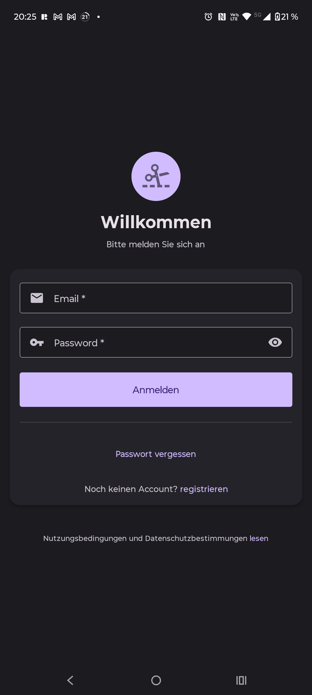
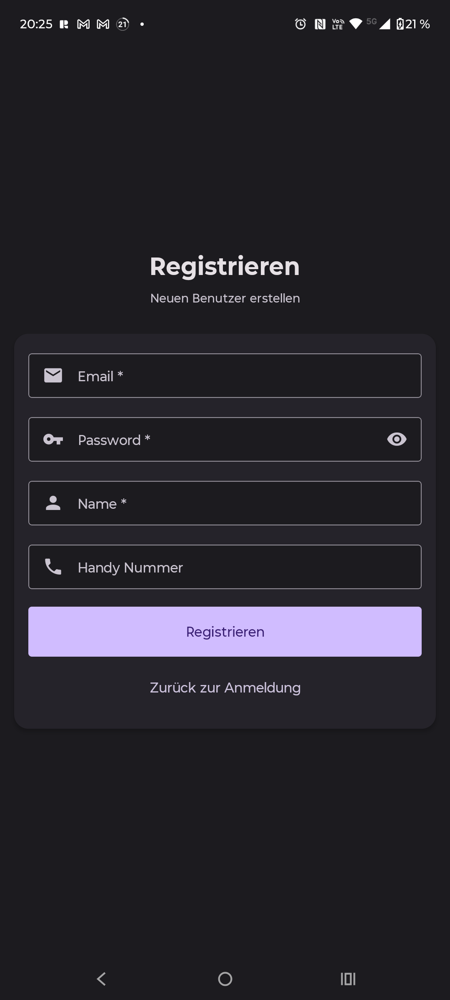
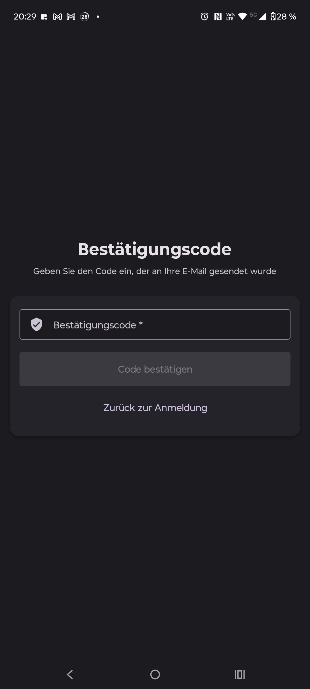

# Friseur-app

Monorepo containing:
- `auth/` — authentication service
- `gateway/` — API gateway
- `mobile/Friseur-mobile/` — React Native (Expo) mobile app

## How to run

### Backend (example)
```bash
cd auth
npm run dev

cd gateway
npm run dev

cd mobile/Friseur-mobile
npm start


---

## 📸 Projektbilder & Schaltplan 

<p align="center">
  
  
  
</p>


---